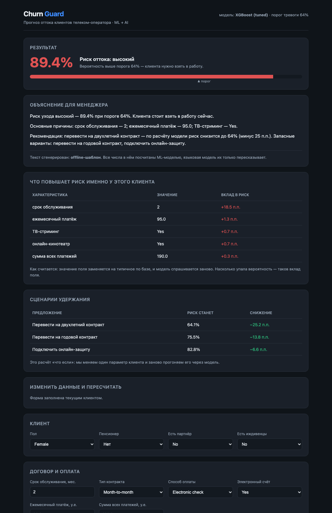

# Churn Guard - предсказание оттока клиентов + AI-объяснение

Итоговый проект курса **Data Science & AI**. Трек выбрала гибридный: ML + AI.

Модель предсказывает, уйдёт ли клиент телеком-оператора к конкуренту, объясняет
**почему** именно этот клиент в зоне риска и рассчитывает, **какое предложение**
снизит риск сильнее всего. Результат доступен через веб-интерфейс на FastAPI.



---

## Результаты

| Метрика | Значение |
|---|---|
| ROC-AUC на отложенном тесте | **0.843** |
| PR-AUC | 0.661 |
| Baseline (логистическая регрессия) | 0.842 |
| Precision / Recall при рабочем пороге 0.64 | 0.61 / 0.65 |
| **Точность топ-5% списка на обзвон** | **86%** попаданий (**lift 3.2×**) |
| Прирост прибыли от правильного порога | **+32%** к порогу 0.5 |

Проще говоря: если обзвонить 5% клиентов, которых модель считает самыми
рискованными, то 86 из 100 действительно собирались уйти. Если звонить
наугад, попали бы только в 26 из 100.

---

## Главные находки анализа

| Находка | Цифра |
|---|---|
| Помесячный контракт против двухлетнего | **43%** оттока против **3%** |
| Первые 6 месяцев обслуживания | **53%** оттока (после 5 лет - 6.6%) |
| Оплата электронным чеком | **45%** оттока против 15% при автоплатеже |
| Нет техподдержки и онлайн-защиты | **~42%** оттока |
| Пол клиента | разница **0.8 п.п.** - признак бесполезен |

Вывод для бизнеса: удерживать нужно **новичков на помесячном контракте**,
а главный рычаг - перевод на длинный контракт и автоплатёж.

---

## Быстрый старт

```bash
# 1. Зависимости
pip install -r requirements.txt

# 2. Обучить модель (~3 минуты, создаёт models/model.pkl)
python src/train.py

# 3. Запустить веб-приложение
uvicorn app:app --reload
# открыть http://127.0.0.1:8000
```

Данные уже лежат в `data/raw/telco_churn.csv`, скачивать ничего не нужно.

### AI-часть (необязательно)

Приложение полностью работает **без всякого ключа** - объяснение собирается
офлайн-шаблоном. Чтобы текст писала языковая модель:

```bash
cp .env.example .env      # вписать свой ключ
export OPENAI_API_KEY="sk-..."
uvicorn app:app --reload
```

---

## Структура проекта

```
final_project_ds/
├── README.md                   ← вы здесь
├── requirements.txt
├── app.py                      ← веб-приложение FastAPI
│
├── src/
│   ├── config.py               ← все константы и экономические параметры
│   ├── data.py                 ← загрузка и очистка данных
│   ├── features.py             ← feature engineering + препроцессор
│   ├── train.py                ← обучение, сравнение моделей, выбор порога
│   ├── predict.py              ← прогноз + объяснение (ML-часть)
│   └── ai_explain.py           ← LLM-объяснение (AI-часть)
│
├── notebooks/
│   └── 01_analysis.ipynb       ← EDA, моделирование, все выводы
│
├── app/templates/              ← HTML-шаблоны интерфейса
├── data/raw/telco_churn.csv    ← исходные данные (7043 клиента)
├── models/                     ← model.pkl + metrics.json
├── reports/figures/            ← все графики
├── screenshots/                ← скриншоты интерфейса
└── docs/
    ├── Churn_Guard_presentation.pptx  ← слайды для защиты (10 слайдов)
    ├── ПРЕЗЕНТАЦИЯ.md          ← что говорить к каждому слайду, с таймингом
    └── ВОПРОСЫ_НА_ЗАЩИТУ.md    ← разбор вопросов преподавателя
```

---

## Данные

**Telco Customer Churn** - 7043 клиента, 19 признаков.
Источник: [OpenML, id 42178](https://www.openml.org/d/42178) (та же таблица, что на Kaggle).

Что пришлось починить при очистке:

| Проблема | Решение | Почему так |
|---|---|---|
| `TotalCharges` - текст, у 11 клиентов пробел | Поставил `0` | У всех 11 `tenure = 0` - они ещё ни разу не платили |
| Значения в кавычках (`'Two year'`) | Снял кавычки | След формата ARFF; иначе одна категория превратится в две |
| 22 полных дубликата | Удалил | Без `customerID` они неотличимы; риск утечки в тест |

---

## Как работает модель

```
данные клиента
      ↓
очистка (data.py)  →  7 новых признаков (features.py)
      ↓
Pipeline: StandardScaler + OneHotEncoder → XGBoost
      ↓
вероятность ухода  →  порог 0.64  →  решение «звонить / не звонить»
      ↓                      ↓
  что повышает риск    какое предложение поможет
      ↓                      ↓
              LLM пишет объяснение менеджеру
```

### Сравнение моделей (5-fold кросс-валидация на train)

| Модель | ROC-AUC | F1 | Recall |
|---|---|---|---|
| Логистическая регрессия (baseline) | 0.8482 | 0.639 | 0.809 |
| Random Forest | 0.8441 | 0.631 | 0.704 |
| XGBoost | 0.8378 | 0.625 | 0.746 |
| **XGBoost после GridSearchCV** | **0.8497** | - | - |
| Логистическая регрессия после GridSearchCV | 0.8482 | - | - |

**Важное замечание.** Разница между победителем и baseline всего **0.0015**,
а разброс между фолдами **±0.016**. То есть модели почти одинаковые и XGBoost
выигрывает в пределах случайности. Если бы это был рабочий проект, я бы
взяла логистическую регрессию: она быстрее и понятнее.

### Почему порог не 0.5

Порог по умолчанию - произвольное число. Правильный считается из экономики:

* контакт с клиентом стоит **20 у.е.**;
* удержанный клиент приносит **200 у.е.**;
* предложение срабатывает в **25%** случаев → ценность контакта 50 у.е.;
* звонить выгодно, пока `precision > 20/50 = 0.4`.

Оптимум - **порог 0.64**: обзваниваем 395 клиентов вместо 583 и зарабатываем
на **32% больше**.

---

## Разделение ML и AI

| | Что делает | Можно ли проверить |
|---|---|---|
| **ML-модель** | считает вероятность, вклад признаков, сценарии «что если» | да, метриками |
| **LLM** | пересказывает готовые числа человеческим языком | нет, и она ничего не считает |

LLM получает в промпте только факты, посчитанные моделью, и инструкцию
«не придумывай новых чисел». Спрашивать у языковой модели «уйдёт ли клиент»
бессмысленно: она не видела наши данные и выдаст правдоподобное, но произвольное число.

---

## API

```bash
curl -X POST http://127.0.0.1:8000/api/predict \
  -H "Content-Type: application/json" \
  -d '{"tenure": 2, "Contract": "Month-to-month", "MonthlyCharges": 95, "TotalCharges": 190}'
```

```json
{
  "proba": 0.8935,
  "percent": 89.4,
  "risk_level": "высокий",
  "will_churn": true,
  "drivers": [{"feature_ru": "срок обслуживания", "value": 2, "effect": 0.1851}],
  "actions": [{"action": "Перевести на двухлетний контракт", "new_proba": 0.6414, "delta": 0.2521}]
}
```

Эндпоинты: `GET /` (форма), `POST /predict` (страница), `POST /api/predict` (JSON), `GET /health`.
Автодокументация Swagger - на `/docs`.

---

## Ограничения

* Данные статичные, без временной метки - реальный отток сезонный.
* Экономические параметры условные; порог изменится вместе с ними.
* Все выводы про удержание - **корреляции**. Чтобы утверждать, что длинный
  контракт *причинно* снижает отток, нужен A/B-тест.
* Вероятности не калиброваны: «0.89» означает «высокий риск», а не строго
  «89 из 100 таких клиентов уйдут».

## Что дальше

* SHAP вместо самодельного метода объяснений;
* калибровка вероятностей (`CalibratedClassifierCV`);
* внешние данные: обращения в поддержку, жалобы, скорость интернета -
  именно они, а не новые комбинации старых колонок, дали бы реальный скачок;
* мониторинг дрейфа данных и регулярное переобучение.
